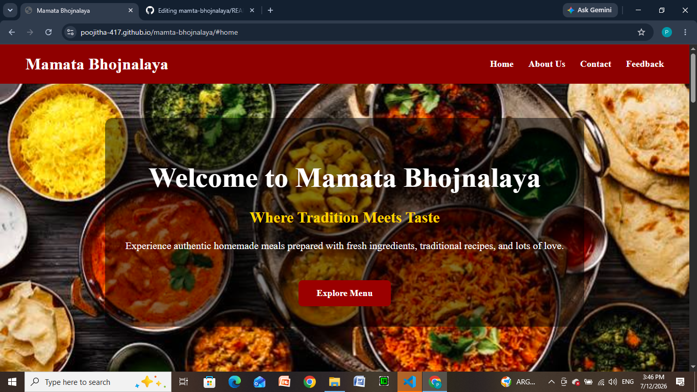
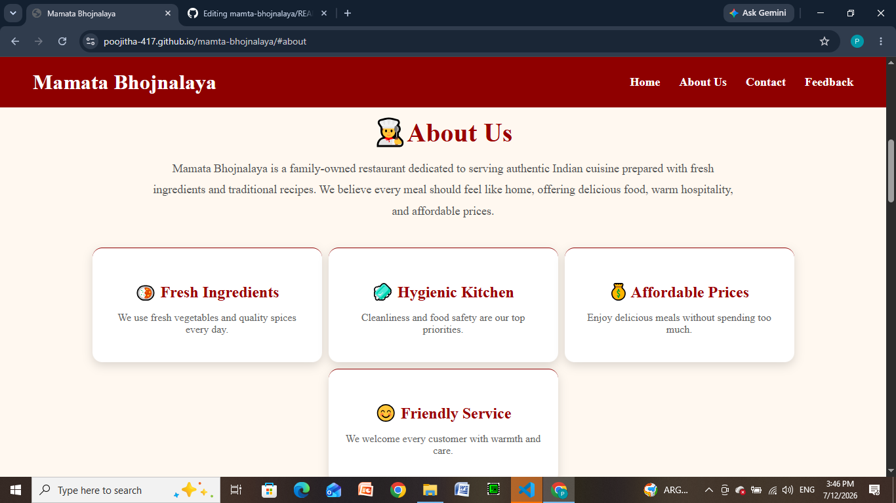
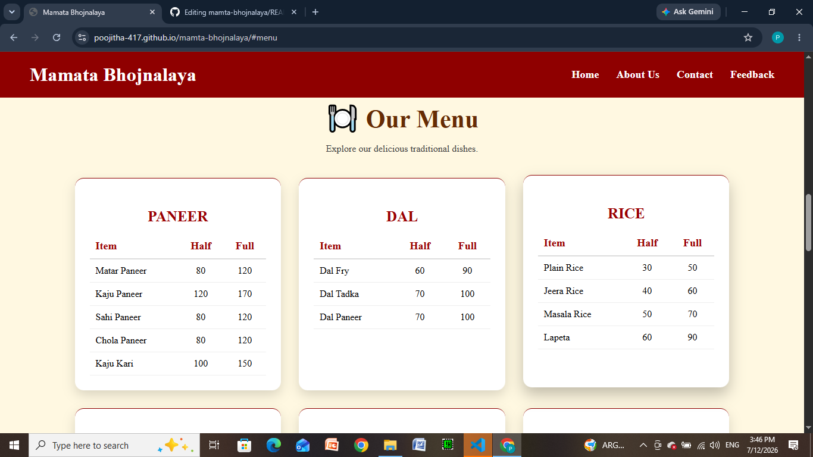
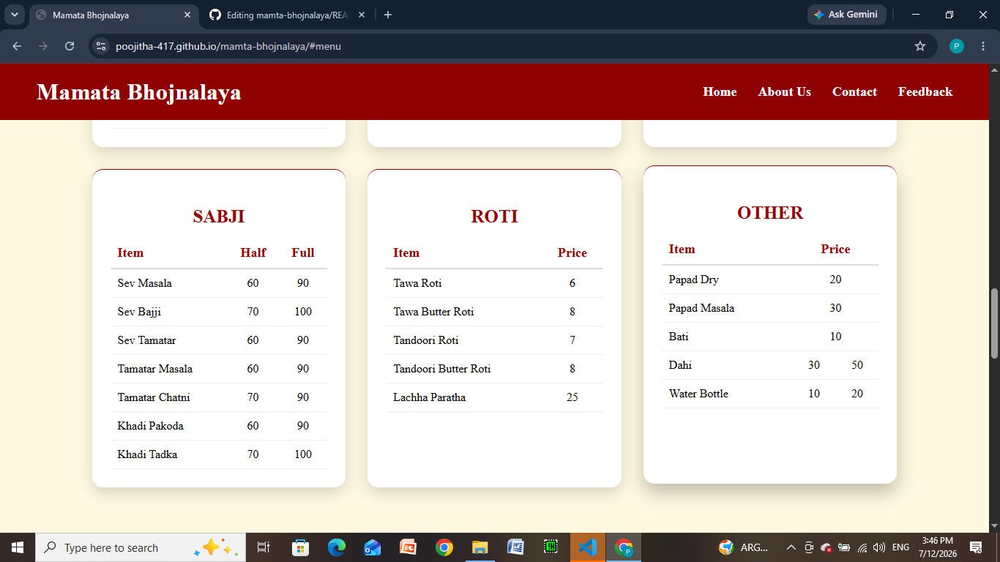
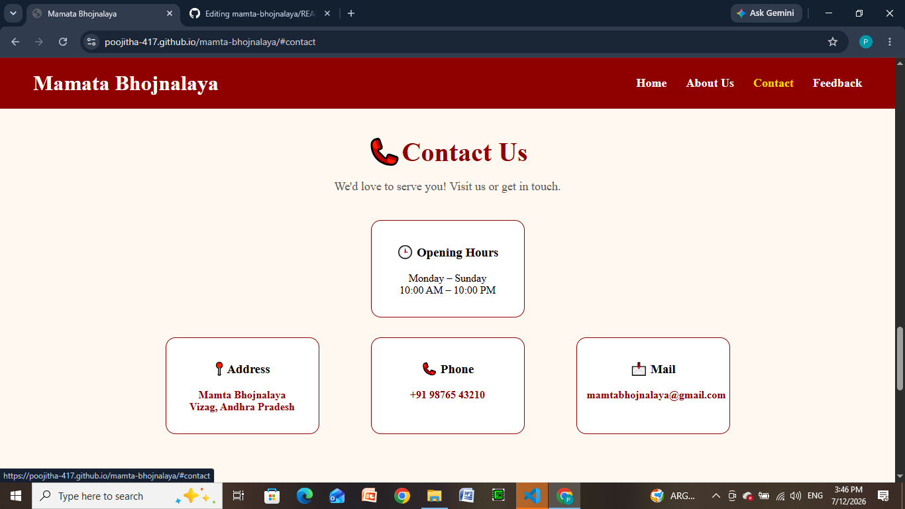
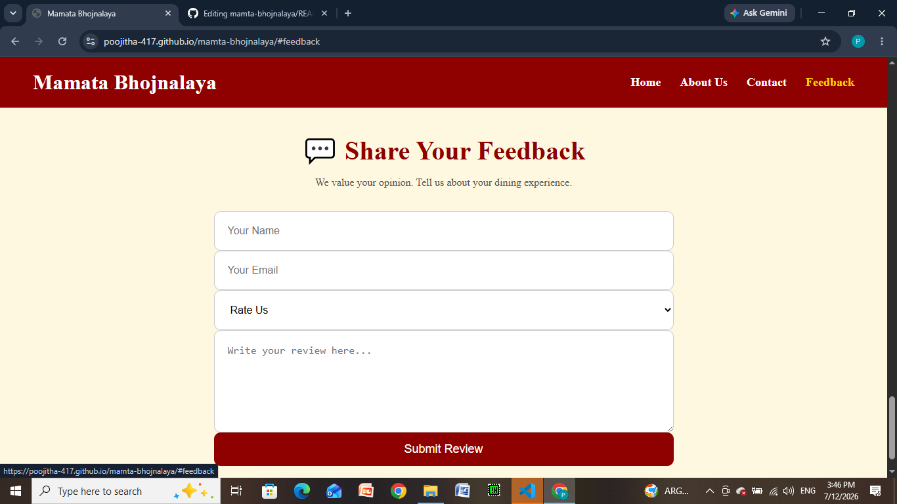

# 🍽️ Mamata Bhojnalaya Restaurant Website

## 📖 Project Description

Mamata Bhojnalaya is a modern and responsive restaurant website developed using **HTML5** and **CSS3**. The website is designed to provide visitors with an engaging browsing experience by showcasing the restaurant's menu, services, contact information, and customer feedback section through a clean and user-friendly interface.

## ✨ Features

- 🏠 Attractive Home Section
- 👨‍🍳 About Us Section
- 🍽️ Restaurant Menu
- 📞 Contact Section
- 📍 Google Maps Location
- 📱 Click-to-Call Phone Number
- 💬 Customer Feedback Form
- 🌐 Smooth Scrolling Navigation
- 📱 Responsive Design

## 🛠️ Technologies Used

- HTML5
- CSS3
- GitHub Pages

## 📂 Project Structure

Mamata-Bhojnalaya/
│
├── index.html
├── style.css
├── README.md
│
└── images/
    ├── HOME.jpeg
    └── (other image assets)

## 📱 Responsive Design

The website is optimized to provide a seamless experience across multiple devices:

- 💻 Desktop
- 💻 Laptop
- 📱 Tablet
- 📱 Mobile

## 🚀 Live Demo

**Website:**  
https://poojitha-417.github.io/mamta-bhojnalaya/

## 🚀 How to Run the Project

1. Download or clone this repository.
2. Open the project folder.
3. Open **index.html** using any modern web browser.
4. Explore the website using the navigation menu.

No additional software or installation is required.

## 📸 Screenshots

### 🏠 Home Section

### 👨‍🍳 About Us Section

### 🍽️ Menu Section

### 📞 Contact Section

### 💬 Feedback Section

## 🎯 Future Enhancements

- Online Table Reservation
- Food Ordering System
- Online Payment Integration
- Dynamic Menu Management
- Customer Login System
- Backend Database Integration

## 👩‍💻 Author

**Battu Poojitha Lakshmi Nagavalli**

**Project:** Mamata Bhojnalaya Restaurant Website

## 📄 License

This project was developed for educational and internship purposes only.
